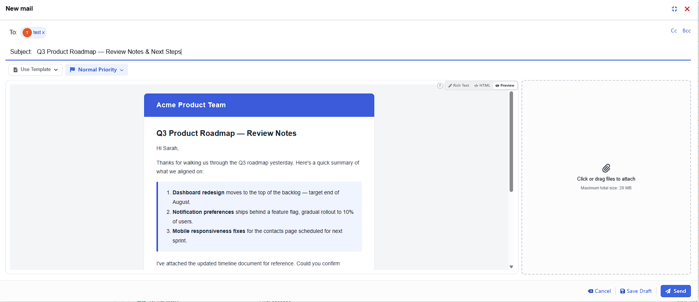
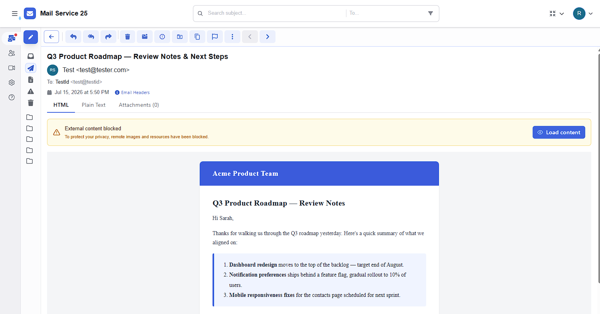

# Yukthi Webmail

A modern, high-performance webmail application built with the latest React ecosystem. Yukthi Webmail leverages a robust technology stack designed for speed, type safety, and a premium user experience.

[](https://discord.gg/29zTxvque)

> 💬 **Join our community on Discord:** [discord.gg/29zTxvque](https://discord.gg/29zTxvque) — ask questions, report bugs, share ideas, and get involved.

## 📸 Screenshots

<p align="center">
  
  
  <br /><br />
  
</p>

## 🚀 Features

- **Modern Architecture:** Built on React 19 and Vite 6 for lightning-fast development and production performance.
- **Type-Safe Routing:** Utilizes **TanStack Router** for fully typed client-side routing.
- **State & Data Management:**
- **TanStack Query** for efficient asynchronous data fetching and caching.
- **Jotai** for atomic, flexible global state management.

- **Rich Text Editing:** Integrated **Tiptap** editor for composing emails with formatting support (bullet lists, underlining, etc.).
- **UI & Styling:**
- **Tailwind CSS 4** for utility-first styling.
- **Radix UI Themes** for accessible, high-quality UI components.
- **React Icons** for a comprehensive icon library.

- **Email Handling:**
- **Postal-Mime** for parsing raw email messages.
- **DomPurify** for sanitizing HTML content to prevent XSS attacks.

- **Forms & Validation:** Robust form handling using **React Hook Form**, **Yup**, and **Hookform Resolvers**.
- **File Handling:** Drag-and-drop file uploads via **React Dropzone**.

## 🛠️ Tech Stack

- **Core:** React 19, ReactDOM 19
- **Build Tool:** Vite 6
- **Language:** TypeScript
- **Styling:** Tailwind CSS v4, Destyle.css
- **Routing:** TanStack Router
- **Utilities:** Date-fns, Use-debounce

## 📦 Getting Started

### Prerequisites

- Node.js (v18 or higher recommended)
- npm (or yarn/pnpm/bun)

### Installation

1. Clone the repository:

```bash
git clone https://github.com/Yukthi-Systems/WebMail-UI
cd WebMail-UI

```

2. Install dependencies:

```bash
npm install

```

## 💻 Development

To start the development server with Hot Module Replacement (HMR):

```bash
npm run dev

```

The application will be available at `http://localhost:5173` (or the port shown in your terminal).

## 🏗️ Building for Production

To create a production-ready build:

```bash
npm run build

```

This command runs the TypeScript compiler (`tsc`) to check for errors and then uses Vite to build the optimized assets.

To preview the production build locally:

```bash
npm run preview

```

## 🧹 Code Quality

This project uses **ESLint** and **Prettier** to maintain code quality and consistent formatting.

- **Linting:** Check for code issues.

```bash
npm run lint

```

- **Formatting:** Auto-format code using Prettier.

```bash
npm run format

```

## 🤝 Contributing

Contributions are welcome! Please feel free to submit a Pull Request.

1. Fork the project
2. Create your feature branch (`git checkout -b feature/AmazingFeature`)
3. Commit your changes (`git commit -m 'Add some AmazingFeature'`)
4. Push to the branch (`git push origin feature/AmazingFeature`)
5. Open a Pull Request

Found a bug or have a feature request? [Open an issue](https://github.com/Yukthi-Systems/WebMail-UI/issues/new/choose).

## 💬 Community

Join our [Discord server](https://discord.gg/29zTxvque) to chat with maintainers and other contributors, ask questions, and stay up to date with the project.
